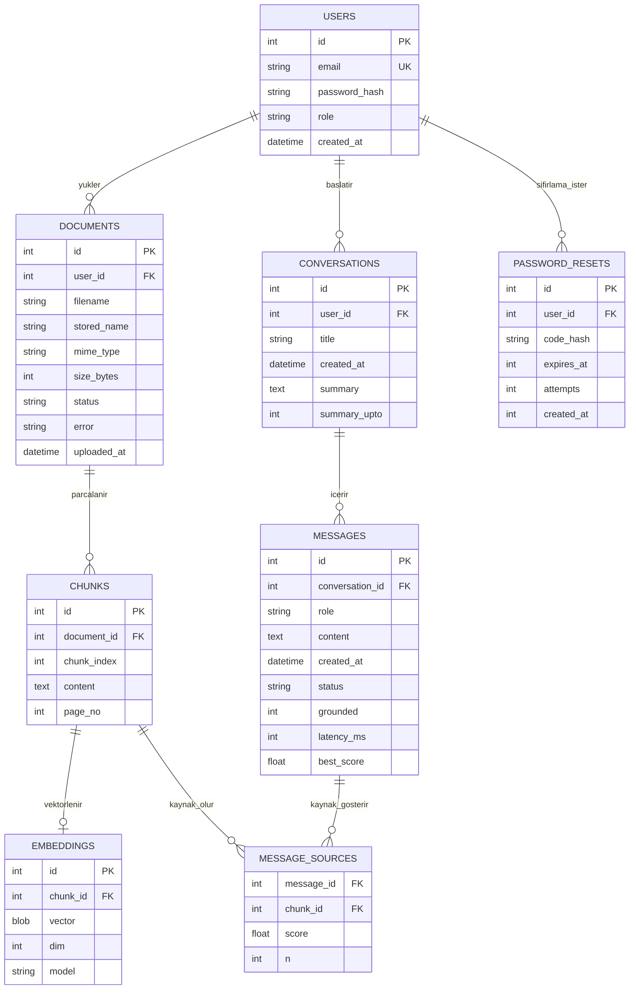

# ER Diyagramı

> Hafta 3 başlangıç modeli. Varlıkları ve ilişkileri kendin gözden geçirip doğrula;
> sözlüde "neden böyle modelledin" diye sorulacak. Hafta 4'te bu modelden `001_init.sql` üretilir.

## İlişki türleri
- USERS 1-N DOCUMENTS, USERS 1-N CONVERSATIONS
- DOCUMENTS 1-N CHUNKS
- CHUNKS 1-1 EMBEDDINGS (bir parçanın en fazla bir vektörü; `chunk_id` UNIQUE)
- CONVERSATIONS 1-N MESSAGES
- MESSAGES N-N CHUNKS — ara tablo MESSAGE_SOURCES (bir cevap birden çok parçaya, bir parça birden çok cevaba dayanabilir)
- USERS 1-N PASSWORD_RESETS (uygulamada kullanıcı başına en fazla bir geçerli kod tutulur; yeni kod eskisini siler)

## Normalizasyon notu
Her tabloda tek bir konu var ve her alan yalnızca birincil anahtara bağlı (3NF). Örneğin belge adı
`chunks` içinde tekrar edilmez, `documents`'ta tutulur. MESSAGE_SOURCES bileşik anahtar
(`message_id`, `chunk_id`) taşır.

## Sonradan eklenen alanlar (migration ile)
- `002_message_quality.sql` (Hafta 11): `messages.status/grounded/latency_ms/best_score` (cevap kalitesi, rapor için), `message_sources.n` (yanıttaki `[n]` işareti hangi kaynak)
- `003_conversation_summary.sql` (Hafta 11): `conversations.summary`, `conversations.summary_upto` (uzun sohbet özeti)
- `004_password_reset.sql` (Hafta 14): `password_resets` tablosu (parola sıfırlama kodu; kodun kendisi değil HMAC özeti saklanır, 15 dk geçerli, en fazla 5 yanlış deneme)

## Kendi gerekçem (doldur)
- Birincil anahtarlar neden bunlar:
- Hangi varlığı eklerdim / çıkarırdım:
