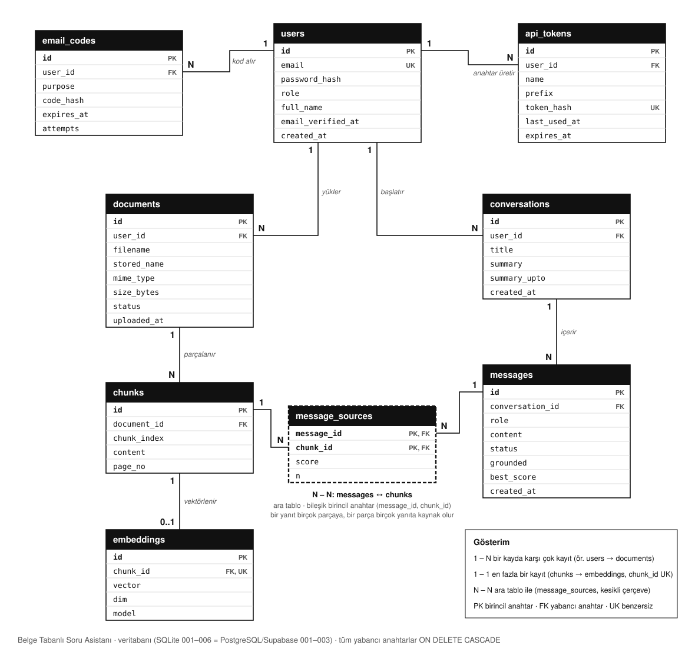
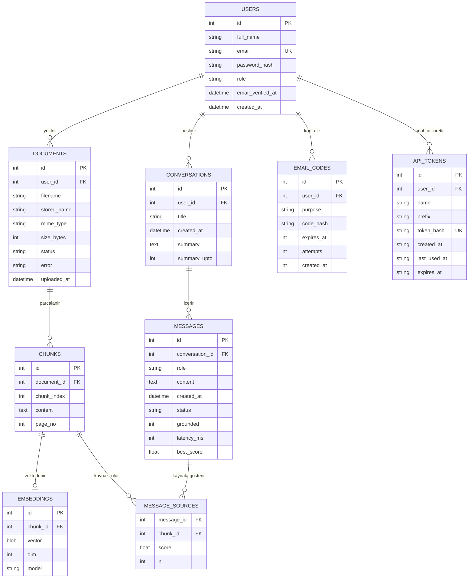

# ER Diyagramı

> Güncel şema (SQLite migration 001–006 = PostgreSQL/Supabase 001–003). Hafta 3 başlangıç modelinden büyüdü;
> varlıkları ve ilişkileri kendin gözden geçirip doğrula;
> sözlüde "neden böyle modelledin" diye sorulacak. Hafta 4'te bu modelden `001_init.sql` üretilir.

*Çizgilerin iki ucundaki **1**, **N**, **0..1** ilişki türünü gösterir; kesikli çerçeveli `message_sources` N-N
ilişkisinin ara tablosudur. Aynı şemanın metin (Mermaid) hâli aşağıda.*

## İlişki türleri
| İlişki | Tür | Nasıl kuruldu (yabancı anahtar) | Anlamı |
|---|---|---|---|
| users → documents | **1 – N** | `documents.user_id` → `users.id` | Bir kullanıcı çok belge yükler; her belgenin tek sahibi var |
| users → conversations | **1 – N** | `conversations.user_id` → `users.id` | Bir kullanıcının çok sohbeti olur |
| users → email_codes | **1 – N** | `email_codes.user_id` → `users.id` | Doğrulama ve sıfırlama kodları (`purpose`: `verify` / `reset`); her amaç için en fazla bir geçerli kod, yenisi eskisini siler |
| users → api_tokens | **1 – N** | `api_tokens.user_id` → `users.id` | Kişisel API anahtarları; kullanıcı başına en fazla `MAX_API_TOKENS_PER_USER` |
| documents → chunks | **1 – N** | `chunks.document_id` → `documents.id` | Bir belge çok parçaya bölünür; `(document_id, chunk_index)` UNIQUE |
| chunks → embeddings | **1 – 1** (0..1) | `embeddings.chunk_id` → `chunks.id`, **UNIQUE** | Bir parçanın en fazla bir vektörü olur; UNIQUE kısıtı ilişkiyi 1-N'den 1-1'e çevirir |
| conversations → messages | **1 – N** | `messages.conversation_id` → `conversations.id` | Bir sohbet çok mesaj içerir |
| messages ↔ chunks | **N – N** | ara tablo `message_sources` (`message_id` + `chunk_id`, ikisi birlikte birincil anahtar) | Bir yanıt birçok parçaya dayanır, bir parça birçok yanıta kaynak olur |

**N-N neden ara tabloyla?** İlişkisel veritabanında bir sütun tek değer tutar (1NF); "bu yanıtın kaynakları 3, 7, 12" gibi bir
liste tek sütuna yazılamaz. Bu yüzden her (yanıt, parça) çifti `message_sources`'ta ayrı bir satırdır; çift birincil anahtar
olduğu için aynı kaynak aynı yanıta iki kez eklenemez. Satır ayrıca ilişkinin kendi bilgisini taşır: `score` (benzerlik) ve
`n` (yanıttaki `[n]` numarası).

**Silme kuralı:** Bütün yabancı anahtarlar `ON DELETE CASCADE`: kullanıcı silinince belgeleri, parçaları, vektörleri,
sohbetleri, mesajları, kodları ve API anahtarları da silinir; yetim (sahipsiz) kayıt kalmaz.

## Normalizasyon notu
Her tabloda tek bir konu var ve her alan yalnızca birincil anahtara bağlı (3NF). Örneğin belge adı
`chunks` içinde tekrar edilmez, `documents`'ta tutulur. MESSAGE_SOURCES bileşik anahtar
(`message_id`, `chunk_id`) taşır.

## Sonradan eklenen alanlar (migration ile)
- `002_message_quality.sql` (Hafta 11): `messages.status/grounded/latency_ms/best_score` (cevap kalitesi, rapor için), `message_sources.n` (yanıttaki `[n]` işareti hangi kaynak)
- `003_conversation_summary.sql` (Hafta 11): `conversations.summary`, `conversations.summary_upto` (uzun sohbet özeti)
- `004_password_reset.sql` (Hafta 14): `password_resets` tablosu (parola sıfırlama kodu; kodun kendisi değil HMAC özeti saklanır, 15 dk geçerli, en fazla 5 yanlış deneme)
- `005_name_and_email_verification.sql` (PostgreSQL: `postgres/002_...`): `users.full_name` (kayıtta alınan ad soyad), `users.email_verified_at` (boş = e-posta doğrulanmadı, giriş yapamaz; bu migration'dan önceki hesaplar doğrulanmış sayılır). `password_resets` → `email_codes`: doğrulama ve sıfırlama kodu aynı kurallarla çalıştığı için tek tablo + `purpose` sütunu.
- `006_api_tokens.sql` (PostgreSQL: `postgres/003_...`): `api_tokens` tablosu (kişisel API anahtarı; anahtarın kendisi değil SHA-256 özeti saklanır, `prefix` listede hangi anahtar olduğu anlaşılsın diye ilk 12 karakter, en fazla 1 yıl geçerli).

## Supabase'de diyagramı görmek
Supabase panelinde **Database → Schema Visualizer** (sol menü) bu tabloları ve aralarındaki yabancı anahtar
çizgilerini otomatik çizer; yukarıdaki Mermaid diyagramı ile aynı olmalı. Tablolar görünmüyorsa:
1. **Table Editor**'da üstteki şema seçicide `public` seçili olsun (tablolar `public` şemasında).
2. Doğru projede olduğundan emin ol: Vercel'deki `DATABASE_URL`'in içindeki `postgres.<proje-kodu>` ile
   Supabase adres çubuğundaki proje kodu aynı olmalı.
3. Backend'in Supabase'e bağlı olduğunu `https://p55-rag-assistant-backend.vercel.app/health` gösterir:
   `"database": "postgres"` olmalı. `"sqlite"` ise Vercel'de `DATABASE_URL` tanımlı değildir.
4. Tablolar hiç kurulmadıysa: `.env`'e Supabase `DATABASE_URL`'ini yazıp `python -m scripts.supabase_kurulum`
   (ya da backend'i bir kez açmak yeter; açılışta migration'lar çalışır). Kontrol için SQL Editor'da:
   `select table_name from information_schema.tables where table_schema = 'public';`

## Kendi gerekçem (doldur)
- Birincil anahtarlar neden bunlar:
- Hangi varlığı eklerdim / çıkarırdım:
