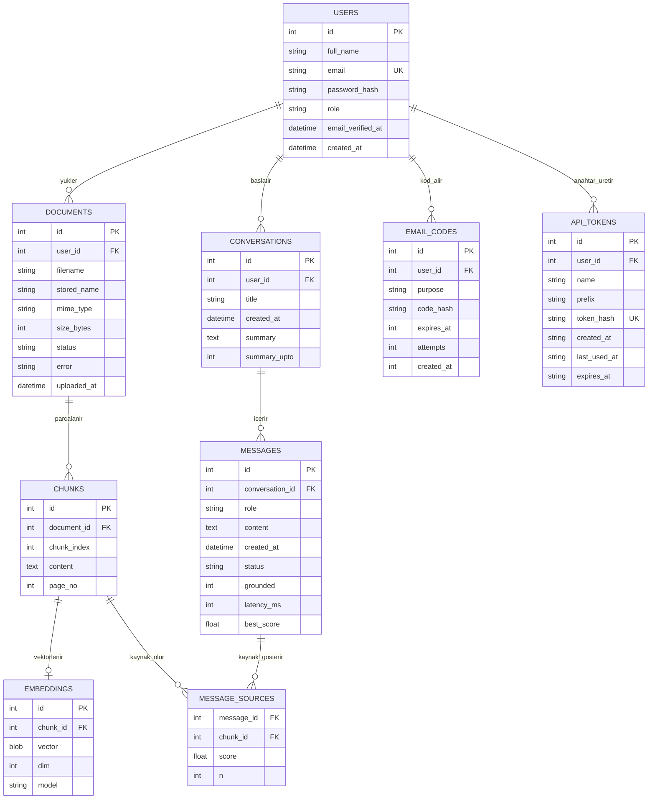

# ER Diyagramı

> Güncel şema (SQLite migration 001–005 = PostgreSQL/Supabase 001–002). Hafta 3 başlangıç modelinden büyüdü;
> varlıkları ve ilişkileri kendin gözden geçirip doğrula;
> sözlüde "neden böyle modelledin" diye sorulacak. Hafta 4'te bu modelden `001_init.sql` üretilir.

## İlişki türleri
- USERS 1-N DOCUMENTS, USERS 1-N CONVERSATIONS
- DOCUMENTS 1-N CHUNKS
- CHUNKS 1-1 EMBEDDINGS (bir parçanın en fazla bir vektörü; `chunk_id` UNIQUE)
- CONVERSATIONS 1-N MESSAGES
- MESSAGES N-N CHUNKS — ara tablo MESSAGE_SOURCES (bir cevap birden çok parçaya, bir parça birden çok cevaba dayanabilir)
- USERS 1-N EMAIL_CODES (`purpose`: `verify` = e-posta doğrulama, `reset` = parola sıfırlama; kullanıcı başına her amaç için en fazla bir geçerli kod, yeni kod eskisini siler)
- USERS 1-N API_TOKENS (kişisel API anahtarları; kullanıcı başına en fazla `MAX_API_TOKENS_PER_USER`, hesap silinince CASCADE ile silinir)

## Normalizasyon notu
Her tabloda tek bir konu var ve her alan yalnızca birincil anahtara bağlı (3NF). Örneğin belge adı
`chunks` içinde tekrar edilmez, `documents`'ta tutulur. MESSAGE_SOURCES bileşik anahtar
(`message_id`, `chunk_id`) taşır.

## Sonradan eklenen alanlar (migration ile)
- `002_message_quality.sql` (Hafta 11): `messages.status/grounded/latency_ms/best_score` (cevap kalitesi, rapor için), `message_sources.n` (yanıttaki `[n]` işareti hangi kaynak)
- `003_conversation_summary.sql` (Hafta 11): `conversations.summary`, `conversations.summary_upto` (uzun sohbet özeti)
- `004_password_reset.sql` (Hafta 14): `password_resets` tablosu (parola sıfırlama kodu; kodun kendisi değil HMAC özeti saklanır, 15 dk geçerli, en fazla 5 yanlış deneme)
- `005_name_and_email_verification.sql` (PostgreSQL: `postgres/002_...`): `users.full_name` (kayıtta alınan ad soyad), `users.email_verified_at` (boş = e-posta doğrulanmadı, giriş yapamaz; bu migration'dan önceki hesaplar doğrulanmış sayılır). `password_resets` → `email_codes`: doğrulama ve sıfırlama kodu aynı kurallarla çalıştığı için tek tablo + `purpose` sütunu.
- `006_api_tokens.sql` (PostgreSQL: `postgres/003_...`): `api_tokens` tablosu (kişisel API anahtarı; anahtarın kendisi değil SHA-256 özeti saklanır, `prefix` listede hangi anahtar olduğu anlaşılsın diye ilk 12 karakter, en fazla 1 yıl geçerli).

## Supabase'de diyagramı görmek
Supabase panelinde **Database → Schema Visualizer** (sol menü) bu tabloları ve aralarındaki yabancı anahtar
çizgilerini otomatik çizer; yukarıdaki Mermaid diyagramı ile aynı olmalı. Tablolar görünmüyorsa:
1. **Table Editor**'da üstteki şema seçicide `public` seçili olsun (tablolar `public` şemasında).
2. Doğru projede olduğundan emin ol: Vercel'deki `DATABASE_URL`'in içindeki `postgres.<proje-kodu>` ile
   Supabase adres çubuğundaki proje kodu aynı olmalı.
3. Backend'in Supabase'e bağlı olduğunu `https://p55-rag-assistant-backend.vercel.app/health` gösterir:
   `"database": "postgres"` olmalı. `"sqlite"` ise Vercel'de `DATABASE_URL` tanımlı değildir.
4. Tablolar hiç kurulmadıysa: `.env`'e Supabase `DATABASE_URL`'ini yazıp `python -m scripts.supabase_kurulum`
   (ya da backend'i bir kez açmak yeter; açılışta migration'lar çalışır). Kontrol için SQL Editor'da:
   `select table_name from information_schema.tables where table_schema = 'public';`

## Kendi gerekçem (doldur)
- Birincil anahtarlar neden bunlar:
- Hangi varlığı eklerdim / çıkarırdım:
