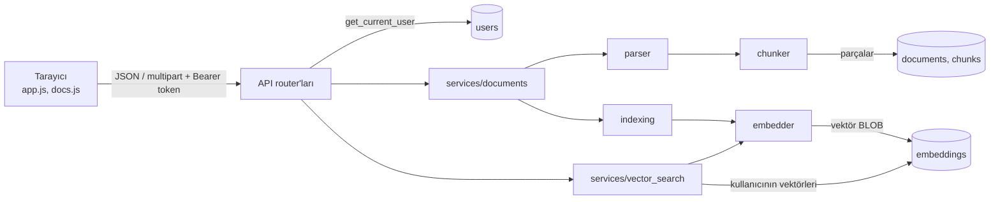

# Adım 6 — Entegrasyon ve web arayüzü (vize)

> Ders planındaki karşılığı: **Hafta 8**. Bu belge eski `hafta-08/README.md` ve `hafta-08/aciklama.md` dosyalarının birleşimidir.

## Ne yapıldı

### Amaç
O ana kadarki modülleri uçtan uca entegre edip çalışan bir ara sürüm ortaya koymak ve vize sözlüsüne hazırlanmak.

### Bu hafta eklenen / değişen dosyalar
| Dosya | Ne işe yarıyor |
|---|---|
| `app/static/index.html`, `app.js`, `docs.js`, `style.css` (şimdi frontend deposunda `public/`) | Basit web arayüzü: giriş/kayıt, belge yükleme/listeleme/silme, arama |
| `app/main.py` | Arayüzü `/` adresinden sunar |
| `app/**` (küçük düzeltmeler) | Kullanıcıya görünen hata mesajları düzgün Türkçe yapıldı |
| `tests/test_uctan_uca.py` | Kayıt → giriş → yükleme → arama → yetki → silme uçtan uca testi |
| `docs/ilerleme-raporu-vize/ilerleme-raporu-vize.md` | Kısa ilerleme raporu (teslim edilecek çıktı) |
| `docs/demo-senaryosu/demo-senaryosu.md` | 5 dakikalık demo akışı |
| `docs/vize-sozlu-hazirlik/vize-sozlu-hazirlik.md` | Mimari özeti, veri akışı, soru-cevap iskeleti |
| `docs/ai-kullanim-gunlugu/ai-kullanim-gunlugu.md` | Güncel AI kullanım günlüğü (Hafta 3–8) |

### Çalıştırma ve demo
```bat
uvicorn app.main:app --reload
```
Tarayıcıda `http://127.0.0.1:8000/` → kayıt ol → giriş yap → belge yükle → "Arama" sekmesinde ara.
Testler: `pytest` (tüm haftalar birlikte, regresyon kontrolü).

### Sürüm etiketi
Vize ara sürümü etiketlenir: `git tag -a v0.1-vize -m "Vize sürümü"` → `git push origin v0.1-vize` (ne zaman yükleneceği hocayla netleştirilir).

### Kendi yapacakların
1. `demo-senaryosu.md` akışını **en az iki kez** baştan sona prova et; takıldığın yeri not al.
2. `vize-sozlu-hazirlik.md` içindeki 3. ve 4. soruların cevaplarını **kendi başına** yaz (en çok zorlandığın entegrasyon; AI'dan aldığın bir kod parçası için satır satır açıklama).
3. `ilerleme-raporu.md` içindeki "kendi değerlendirmem" bölümlerini doldur.
4. `docs/ai-kullanim-gunlugu/ai-kullanim-gunlugu.md` içindeki tüm haftaların "kendi" alanlarını doldur: vizede **tüm kodu** açıklayabilmelisin.

### Kontrol listesi
- [x] Ara sürüm çalışıyor (kullanıcı + veritabanı + çekirdek modüller uçtan uca)
- [x] Modüller entegre
- [ ] Tüm kodu açıklayabiliyorum
- [x] `v0.1-vize` etiketi GitHub'da (2026-10-04, iki depoda)

## Kod açıklaması

### Modüller arası veri akışı

**Hangi modül hangi veriyi nereden alıyor?**
- API → kullanıcıyı token'dan çözüp `users` tablosundan okur.
- `documents` servisi → dosya baytlarını API'den, kullanıcıyı `get_current_user`'dan alır; `parser` → metin, `chunker` → parça üretir; parçalar `chunks` tablosuna yazılır.
- `indexing` → parçaları `chunks`'tan okur, `embedder`'dan vektör alır, `embeddings`'e yazar.
- `vector_search` → soruyu `embedder` ile vektöre çevirir, yalnızca o kullanıcının vektörlerini `embeddings`'ten okur, skorlayıp döndürür.

### Arayüz
`app.js` — `App.request()` her istekte `Authorization: Bearer` başlığını ekler, 401 gelirse oturumu kapatır, hata mesajını gösterir.
Token `sessionStorage`'da tutulur (sekme kapanınca silinir; `localStorage` kalıcıdır ve XSS durumunda daha riskli).
**Sunucudan gelen metinler hiçbir yerde `innerHTML` ile yazılmaz**, `textContent`/`createTextNode` kullanılır → bir belgenin adı `<script>...` olsa bile çalışmaz (testle denetleniyor).
`docs.js` — belge tablosu, yükleme (`FormData`), silme, yeniden indeksleme ve arama sonuçlarını çizer.
Yetki kontrolü arayüzde değil **sunucudadır**; arayüz yalnızca kullanıcı deneyimi içindir.

### Satır satır örnek (sözlüde "AI'dan aldığın bir kod parçasını açıkla" sorusu için)
`chunker.split_text` içindeki ana döngü:
```python
chunks, cur = [], []                                         # 1
for u in units:                                              # 2
    if cur and len(" ".join(cur)) + 1 + len(u) > size:       # 3
        chunks.append(" ".join(cur))                         # 4
        carry, total = [], 0                                 # 5
        for s in reversed(cur):                              # 6
            if total >= overlap:                             # 7
                break
            carry.insert(0, s)                               # 8
            total += len(s) + 1                              # 9
        if len(" ".join(carry)) + 1 + len(u) > size:         # 10
            carry = []
        cur = carry                                          # 11
    cur.append(u)                                            # 12
if cur:                                                      # 13
    chunks.append(" ".join(cur))
```
1. `chunks` bitmiş parçaları, `cur` şu an doldurulan parçanın cümlelerini tutar.
2. Metnin cümle birimleri (`units`) sırayla işlenir.
3. Bu cümleyi eklersem (araya 1 boşlukla) parça `size` karakteri aşar mı? Aşıyorsa mevcut parça kapanmalı. (`cur and` → ilk cümlede kapatma yapma.)
4. Dolu parçayı sonuca ekle.
5-9. **Örtüşme:** önceki parçanın son cümlelerinden başlayarak geriye doğru cümle topla; toplam uzunluk `overlap`'e ulaşınca dur. Böylece yeni parça, öncekinin kuyruğuyla başlar.
10. Örtüşme + yeni cümle yine sığmıyorsa örtüşmeyi at (aksi halde parça `size`'ı aşardı).
11. Yeni parça örtüşme cümleleriyle başlar.
12. Mevcut cümle yeni (veya devam eden) parçaya eklenir.
13. Döngü bitince son, yarım kalmış parçayı da sonuca ekle (yoksa metnin sonu kaybolurdu).

### Sözlü sınav soruları (PDF) ve cevap iskeleti
**1) Şu ana kadarki mimarini özetle.** Katmanlı: tarayıcı → API (kimlik/yetki) → servisler (ayrıştırma, parçalama, gömme, arama) → SQLite. Yükleme hattı: `dosya → metin → parçalar → vektörler`; arama: `soru → vektör → kosinüs → en yakın parçalar`. Detay: `vize-sozlu-hazirlik.md`.
**2) Hangi modül hangi veriyi nereden alıyor?** Yukarıdaki veri akışı şeması.
**3) En çok zorlandığın entegrasyon neydi, nasıl çözdün?** → **Kendi deneyiminle yaz.** Olası başlıklar: `foreign_keys` pragmasının kapalı gelmesi, farklı embedding modellerinin vektörlerinin karışması (model adını saklayarak çözdüm), embedding hatasında parçaları kaybetmemek (`failed` + `reindex`).
**4) Yapay zekâdan aldığın bir kod parçasını satır satır açıkla.** → yukarıdaki chunker döngüsü; kendi cümlelerinle tekrar anlat.
**5) Bir sonraki aşamanın planı nedir?** Hafta 9: Claude API istemcisi (hata/zaman aşımı/yeniden deneme); Hafta 10: RAG ile kaynaklı yanıt; Hafta 11: sohbet geçmişi ve bağlam; Hafta 12: kullanım raporu.

### Sık yapılan hatalar
Entegrasyonu son ana bırakmak · ara sürümü etiketlememek · açıklanamayan AI kodu taşımak.
