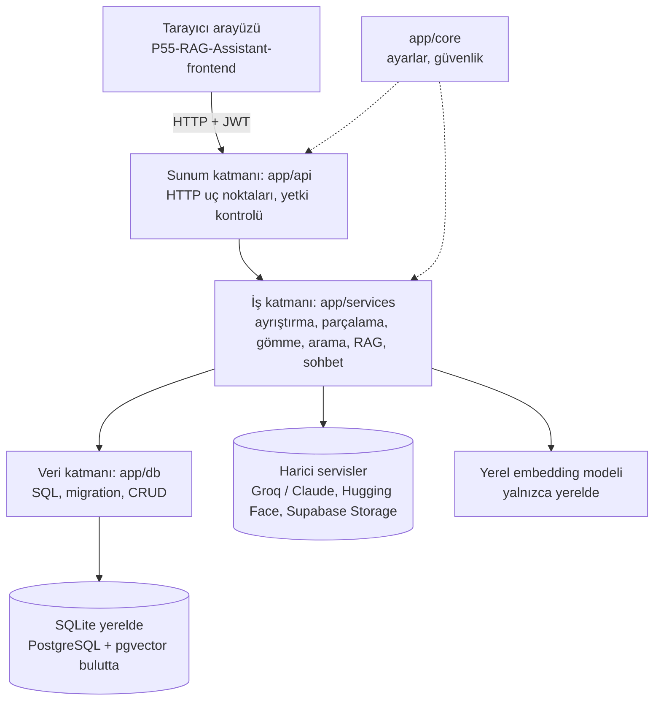
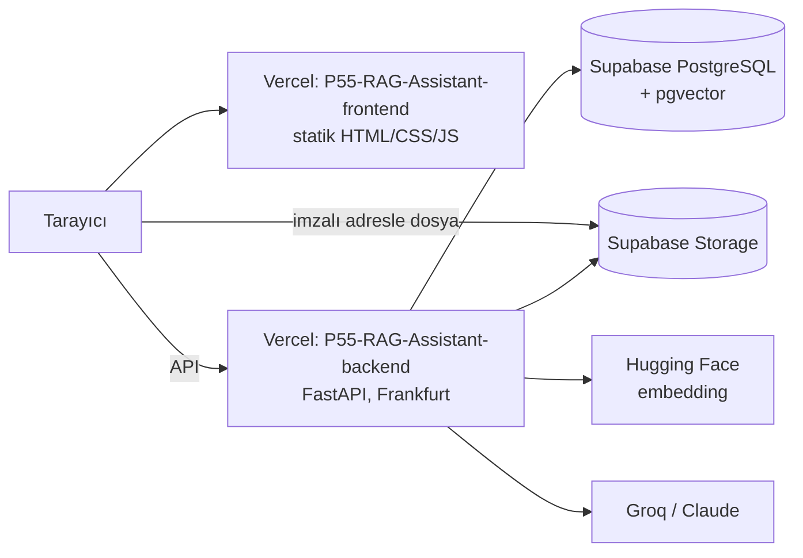

# Mimari

## Uygulamanın katmanları (backend içi)

## Dağıtım (iki depo, bulut)

Arayüz ve API ayrı depolarda, ayrı adreslerde çalışır. Arayüz backend adresini `config.js`'ten okur; backend yalnızca
`ALLOWED_ORIGINS`'teki adreslerden gelen tarayıcı isteklerine izin verir (CORS). Ayrıntı: [`dagitim.md`](dagitim.md).

## Katmanların görevi
- **Sunum (app/api):** İstekleri alır, doğrular, kimlik/rol kontrolü yapar, servisleri çağırır. İş mantığı içermez.
- **İş (app/services):** Belge ayrıştırma, chunking, embedding, benzerlik arama, RAG ve sohbet bağlamı burada.
- **Veri (app/db):** Yalnızca SQL: bağlantı, migration, CRUD fonksiyonları. Aynı SQL hem SQLite'ta hem PostgreSQL'de çalışır; farkları `database.PgConnection` kapatır.
- **Çekirdek (app/core):** Ayarlar (`config.py`) ve güvenlik yardımcıları (`security.py`, Hafta 5).

Bağımlılık yönü tek yönlüdür: api → services → db. Alt katman üst katmanı bilmez.

## Gerekçem
- **Katmanlı mimariyi neden seçtim:** Her katmanın tek bir işi var: `api` isteği alır ve yetkiyi denetler, `services`
  asıl işi (ayrıştırma, parçalama, arama, RAG) yapar, `db` yalnızca SQL çalıştırır. Bir katmanı değiştirince ötekiler
  etkilenmiyor. Bunu projede yaşadım: bulutta PostgreSQL'e geçerken değişikliğin çoğu `app/db` içinde kaldı
  (`PgConnection`, ortak SQL); uç noktalar ve servisler büyük ölçüde aynı kaldı. Test de kolaylaşıyor: servisleri HTTP
  sunucusu açmadan doğrudan fonksiyon olarak test edebiliyorum. Böylece ders paketindeki "her şeyi tek katmanda toplamak"
  hatasına da düşmüyorum. Eksisi: küçük bir özellik için bile çoğu zaman üç dosyaya (api, services, db) dokunmak gerekiyor.
- **SQLite'ı neden seçtim (yerel) ve bulutta neden PostgreSQL'e (Supabase) geçtim:** SQLite kurulum istemiyor, Python'la
  birlikte geliyor ve veritabanı tek bir dosya (`data/asistan.db`). Geliştirirken ve testlerde her test saniyeler içinde kendi
  boş veritabanını açabiliyor. Saf SQL yazdığım için tabloları, kısıtları ve migration'ları doğrudan görüyorum. Bulutta
  ise Vercel'in diski kalıcı değil (yalnızca `/tmp`, her açılışta silinebilir); SQLite dosyası orada yaşayamaz.
  Supabase ücretsiz planda hem PostgreSQL hem pgvector (vektör aramasını veritabanının içinde `<=>` ile yapmak) hem de
  dosyalar için Storage veriyor. Aynı SQL iki tarafta da çalışsın diye ortak sözdizimini (`RETURNING id`, `ON CONFLICT`)
  kullandım; hangi veritabanının kullanılacağına `DATABASE_URL` karar veriyor.
- **Klasör yapısını hangi mantıkla kurdum:** `app/` altında her katmanın kendi klasörü var (`api`, `services`, `db`,
  `core`). Dosya adları modülü gösteriyor: `documents.py` hem `api`'de hem `services`'te hem `db`'de var, her biri belge
  işinin o katmandaki parçası. Şema değişiklikleri `app/db/migrations/` altında numaralı dosyalar (001, 002 …);
  PostgreSQL'inkiler `migrations/postgres/` altında. Eski migration değiştirilmez, yenisi eklenir. `tests/` uygulamadan
  ayrı; `scripts/` bir kez çalıştırılan araçlar (yönetici açma, örnek veri, Supabase kurulumu); `docs/` bütün belgeler ve
  raporlar. Gizli ve geçici dosyalar (`.env`, `*.db`, `uploads/*`) `.gitignore`'da.
- **Frontend ve backend'i neden iki ayrı depoya ayırdım:** Arayüz yalnızca HTML/CSS/JS, backend ise Python. Vercel ikisini
  farklı biçimde yayınlıyor (biri statik dosya, öteki Python fonksiyonu). Ayrı depoda olunca arayüzde bir düğmeyi
  değiştirdiğimde backend yeniden yayınlanmıyor, tersi de geçerli. Arayüz backend'le yalnızca HTTP API üzerinden
  konuşuyor; aynı API'yi başka bir uygulama da kullanabiliyor (kişisel API anahtarı özelliği bunu gösteriyor). Bedeli:
  CORS ayarı (`ALLOWED_ORIGINS`), arayüzde backend adresinin tutulması (`config.js`) ve iki depoda ayrı commit/etiket.
