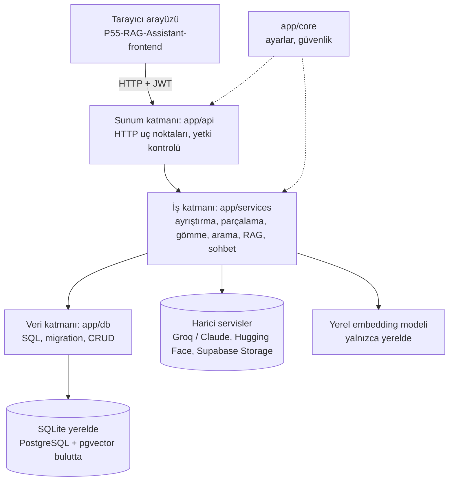
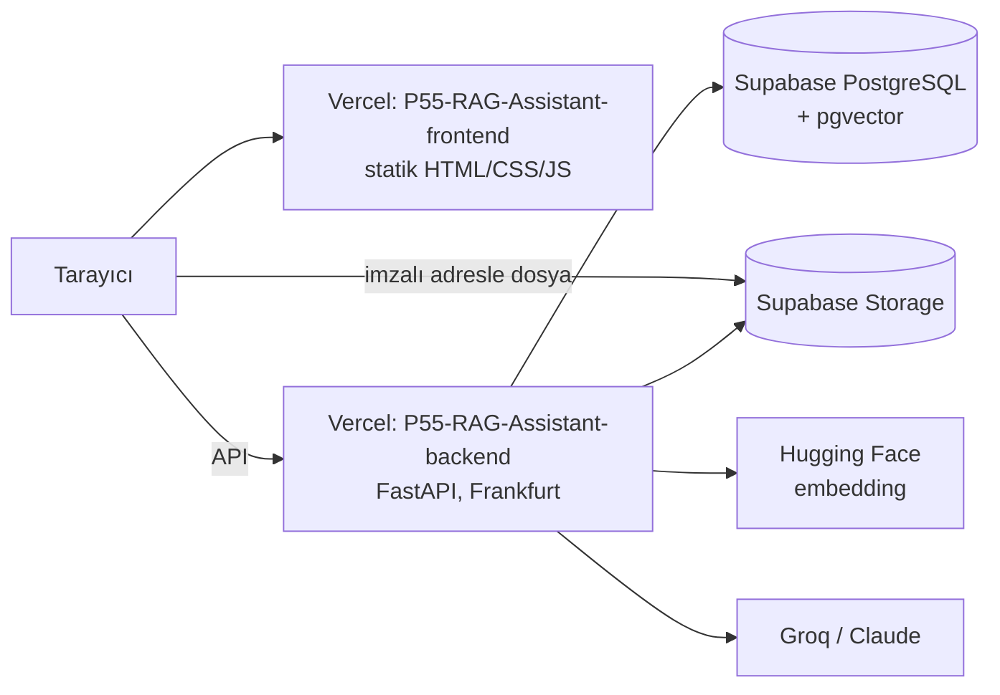

# Mimari

## Uygulamanın katmanları (backend içi)

## Dağıtım (iki depo, bulut)

Arayüz ve API ayrı depolarda, ayrı adreslerde çalışır. Arayüz backend adresini `config.js`'ten okur; backend yalnızca
`ALLOWED_ORIGINS`'teki adreslerden gelen tarayıcı isteklerine izin verir (CORS). Ayrıntı: [`dagitim.md`](dagitim.md).

## Katmanların görevi
- **Sunum (app/api):** İstekleri alır, doğrular, kimlik/rol kontrolü yapar, servisleri çağırır. İş mantığı içermez.
- **İş (app/services):** Belge ayrıştırma, chunking, embedding, benzerlik arama, RAG ve sohbet bağlamı burada.
- **Veri (app/db):** Yalnızca SQL: bağlantı, migration, CRUD fonksiyonları. Aynı SQL hem SQLite'ta hem PostgreSQL'de çalışır; farkları `database.PgConnection` kapatır.
- **Çekirdek (app/core):** Ayarlar (`config.py`) ve güvenlik yardımcıları (`security.py`, Hafta 5).

Bağımlılık yönü tek yönlüdür: api → services → db. Alt katman üst katmanı bilmez.

## Gerekçem (kendi cümlelerinle doldur)
- Katmanlı mimariyi neden seçtim:
- SQLite'ı neden seçtim (yerel) ve bulutta neden PostgreSQL'e (Supabase) geçtim:
- Klasör yapısını hangi mantıkla kurdum:
- Frontend ve backend'i neden iki ayrı depoya ayırdım:
