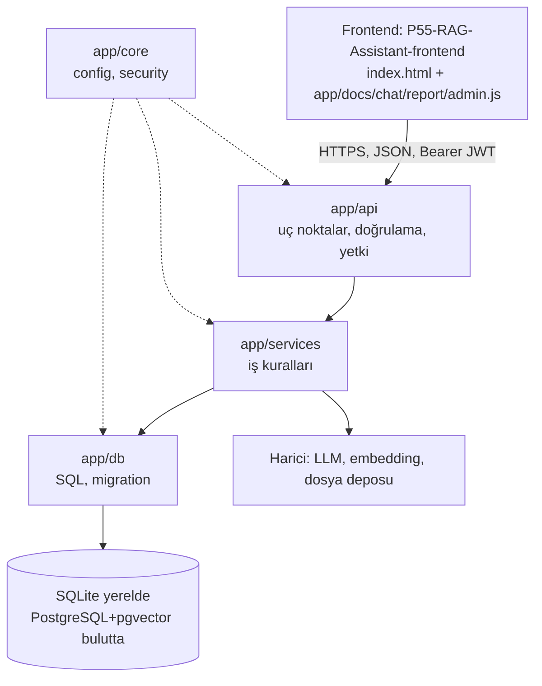
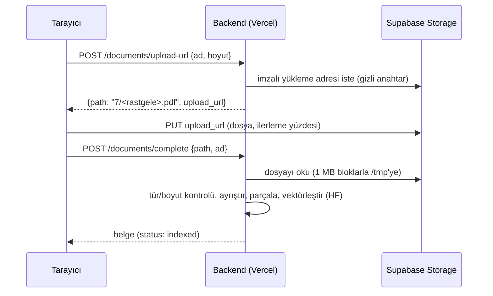

# Teknik Dokümantasyon

P55 – Belge Tabanlı Soru-Cevap Asistanı (RAG). Bu belge sistemi **başka bir geliştiricinin** anlayıp değiştirebileceği
ayrıntıda anlatır. Kurulum: [`../README.md`](../README.md) · Bulut: [`dagitim.md`](dagitim.md) · ER diyagramı: [`er-diyagrami.md`](er-diyagrami.md).

## 1. Genel yapı

- **Tek yönlü bağımlılık:** `api → services → db`. Servisler HTTP bilmez (kendi istisnalarını atar, API katmanı HTTP koduna çevirir); veri katmanı iş kuralı bilmez.
- **Ayarlar** (`app/core/config.py`) ortam değişkenlerinden okunur ve kod içinde **çağrı anında** `config.X` diye kullanılır (testler değerleri değiştirebilsin).
- **Yerel / bulut farkı kodda değil ayarlardadır:** `DATABASE_URL`, `EMBEDDING_BACKEND`, `STORAGE_BACKEND`.

## 2. Modüller
| Dosya | Görevi |
|---|---|
| `app/main.py` | FastAPI uygulaması: açılışta migration, yükleme boyutu ön kontrolü (gövde okunmadan 413), CORS, router'lar |
| `app/core/config.py` | Tüm ayarlar; `is_postgres()`, `check_secret_key()` (üretimde zayıf anahtarla açılmaz) |
| `app/core/security.py` | scrypt parola özeti, JWT üretme/doğrulama |
| `app/api/deps.py` | Ortak bağımlılıklar: istek başına veritabanı bağlantısı, `get_current_user` (JWT ya da `p55_` API anahtarı; rol her istekte DB'den), `require_session` (hesap yönetimi yalnızca giriş oturumuyla), `require_admin`, `get_llm` |
| `app/api/auth.py` | Kayıt, giriş, `/auth/me`, Hesabım, API anahtarları, şifremi unuttum / sıfırla |
| `app/services/api_tokens.py` | Kişisel API anahtarı: `secrets` ile üretim, SHA-256 özetle saklama, süre/sayı sınırı, doğrulama, iptal |
| `app/api/documents.py` | Yükleme (doğrudan ve depo üzerinden), listeleme, parçalar, silme, yeniden indeksleme, sınırlar |
| `app/api/search.py`, `ask.py` | Anlamsal arama; tek seferlik kaynaklı soru |
| `app/api/conversations.py` | Sohbet oluşturma/listeleme/silme, mesaj gönderme (RAG + geçmiş) |
| `app/api/reports.py`, `admin.py` | Kullanım raporu ve CSV; yönetici işlemleri |
| `app/services/auth.py` | Kayıt (`sign_up`: ad soyad + e-posta + parola) / giriş kuralları, e-posta normalleştirme, doğrulanmamış hesabın girişini engelleme, başarısız giriş kilidi (bellekte) |
| `app/services/email_codes.py` | 6 haneli tek kullanımlık kod: üretme, HMAC özeti, süre, 5 deneme, 60 sn yeniden gönderme sınırı (doğrulama ve sıfırlama ortak) |
| `app/services/email_verification.py`, `password_reset.py`, `mailer.py` | Kayıtta e-posta doğrulama; şifremi unuttum; SMTP ile gönderim |
| `app/services/documents.py` | Dosya adı temizleme, tür/içerik kontrolü, diske 1 MB bloklarla yazma, ayrıştır → parçala → indeksle; Supabase Storage akışı |
| `app/services/parser.py` | TXT (UTF-8 / cp1254), PDF (pypdf, sayfa numaralı), DOCX (python-docx, zip-bombası kontrolü) |
| `app/services/chunker.py` | Paragraf/cümle sınırına saygılı, örtüşmeli parçalama (600/100 karakter) |
| `app/services/embedder.py` | `LocalEmbedder` (sentence-transformers), `HFEmbedder` (aynı model, Hugging Face API), `HashingEmbedder` (test yedeği). Hepsi L2-normalize |
| `app/services/indexing.py` | Parçaları 64'lük gruplarla vektörleştirir; önce hepsini üretir, sonra eskileri silip yazar |
| `app/services/vector_search.py` | SQLite'ta numpy ile nokta çarpımı; PostgreSQL'de pgvector (`<=>`) |
| `app/services/rag.py`, `prompts.py` | Bağlam oluşturma, `MIN_SCORE` eşiği, `[n]` alıntı doğrulama, `BILGI_YOK` kuralı |
| `app/services/chat.py` | Sohbet geçmişi, takip sorusunu bağımsız soruya çevirme, uzun geçmişte özetleme |
| `app/services/llm_client.py` | Claude ve Groq istemcileri (urllib), yeniden deneme, zaman aşımı, anlaşılır hatalar |
| `app/services/storage.py` | Supabase Storage: imzalı yükleme adresi, okuma, silme, kova oluşturma |
| `app/services/account.py` | Hesabım: ad değiştirme, parola değiştirme ve hesap silme (ikisi de mevcut parolayı ister), son yönetici koruması |
| `app/services/reports.py`, `admin.py` | Toplulaştırma SQL'leri, CSV (formül enjeksiyonu önlemli); kullanıcı + dosyalarını silme |
| `app/db/database.py` | Bağlantı (SQLite veya PostgreSQL), `PgConnection` sarmalayıcısı, migration çalıştırıcı |
| `app/db/*.py` | Tablo başına CRUD (parametreli SQL) |
| `app/db/migrations/00N_*.sql` | SQLite şeması; `migrations/postgres/001_init.sql` aynı şemanın PostgreSQL hâli |

### İki veritabanı, tek SQL
Depo modülleri iki veritabanında da çalışan SQL yazar: `?` yer tutucusu, `INSERT … RETURNING id`, `ON CONFLICT`,
`substr(created_at, 1, 10)`. Farklar `database.PgConnection` içinde kapatılır (`?` → `%s`, satırların hem `row[0]` hem
`row["ad"]` ile okunması, `with conn:` ile işlem). Lehçeye özgü tek yer vektör aramasıdır (`database.dialect(conn)`).
Tarih sütunları iki veritabanında da `'YYYY-MM-DD HH:MM:SS'` (UTC) metnidir; rapor ve arayüz kodu aynı kalır.

## 3. Veri modeli
`users` 1–N `documents` 1–N `chunks` 1–1 `embeddings` · `users` 1–N `conversations` 1–N `messages` N–N `chunks`
(`message_sources`, `[n]` numarasıyla) · `users` 1–N `email_codes` (`purpose`: `verify` / `reset`). Tüm alt kayıtlar `ON DELETE CASCADE` ile silinir.
Ayrıntı ve diyagram: [`er-diyagrami.md`](er-diyagrami.md).

## 4. API uç noktaları
Kimlik doğrulama: `Authorization: Bearer <JWT>` (🔒) ya da 3. parti uygulamalar için `Authorization: Bearer p55_…` (kişisel API anahtarı, aynı başlık). 🔑 = yalnızca giriş oturumu (JWT); API anahtarıyla 403. Yönetici gerektirenler 👑 (yönetim işlemleri de yalnızca oturumla). Canlı belge: `/docs` (Swagger).

| Yöntem | Yol | | Açıklama |
|---|---|---|---|
| GET | `/health` | | Sağlık kontrolü → `{"status":"ok","database":"postgres"}` (hangi veritabanı; adres/parola değil) |
| POST | `/auth/register` | | Kayıt: `full_name` (2–100, en az bir harf), `email`, `password` (≥ 8, harf+rakam). Hesap doğrulanmamış açılır, e-postaya 6 haneli kod gider → `verification_required: true`. 409: e-posta kayıtlı ve doğrulanmış · 503: e-posta (SMTP) ayarlı değil |
| POST | `/auth/verify-email` | | `{email, code}` → kod doğruysa e-posta doğrulanır ve `access_token` döner (doğrudan giriş). 400: kod hatalı/süresi dolmuş |
| POST | `/auth/resend-verification` | | Yeni doğrulama kodu (kayıtlı/kayıtsız aynı yanıt; 60 sn'de bir) |
| POST | `/auth/login` | | Giriş → `access_token`. 401 yanlış bilgi, 403 e-posta doğrulanmamış (parola doğruysa), 429 çok fazla deneme |
| GET | `/auth/me` | 🔒 | Oturumdaki kullanıcı |
| PATCH | `/auth/me` | 🔑 | `{full_name}` → adı değiştir |
| POST | `/auth/change-password` | 🔑 | `{current_password, new_password}`. 400: mevcut parola hatalı / yeni parola zayıf veya eskisiyle aynı |
| GET | `/auth/tokens` | 🔑 | Kendi API anahtarların: `id, name, prefix, created_at, last_used_at, expires_at, expired` (anahtarın kendisi yok) |
| POST | `/auth/tokens` | 🔑 | `{name, expires_in_days}` (7/30/90/365, varsayılan 90) → 201, `token` alanı anahtarın **tek** gösterimi. 400 ad/süre, 409 sayı sınırı |
| DELETE | `/auth/tokens/{id}` | 🔑 | Anahtarı iptal et; o anahtarla gelen sonraki istek 401. Başkasının anahtarı 404 |
| DELETE | `/auth/me` | 🔑 | `{password}` → hesabı ve tüm verisini (dosyalar dahil) sil. 409: son yönetici |
| POST | `/auth/forgot-password` | | Sıfırlama kodu e-postası (kayıtlı/kayıtsız aynı yanıt). 503: e-posta ayarlı değil |
| POST | `/auth/reset-password` | | Kod + yeni parola (e-postaya ulaşıldığı kanıtlandığı için doğrulanmamış hesap da doğrulanmış olur) |
| GET | `/documents/limits` | 🔒 | `max_upload_mb`, izinli uzantılar, `upload_mode` (`direct` / `storage`) |
| POST | `/documents` | 🔒 | Dosyayı doğrudan yükle (multipart, yerel). 400 tür/içerik, 413 boyut |
| POST | `/documents/upload-url` | 🔒 | Bulut 1. adım: `{filename, size_bytes}` → `{path, upload_url}` |
| POST | `/documents/complete` | 🔒 | Bulut 3. adım: `{path, filename}` → depodaki dosyayı işle |
| GET | `/documents` | 🔒 | Kendi belgelerim |
| GET | `/documents/{id}` | 🔒 | Belge (başkasınınsa 404 — varlığı sızdırılmaz) |
| GET | `/documents/{id}/chunks` | 🔒 | Parçalar (`limit` 1–200, `offset`) |
| DELETE | `/documents/{id}` | 🔒 | Belgeyi, parçalarını, vektörlerini ve dosyasını sil |
| POST | `/documents/{id}/reindex` | 🔒 | Yeniden vektörleştir (bulutta kaldığı yerden, süre bütçesi kadar). 503: embedding üretilemedi |
| POST | `/documents/{id}/index-next` | 🔒 | Büyük belgenin indekslenmesine kaldığı yerden devam (`INDEX_BUDGET_SECONDS` kadar). Durum `chunked` iken yanıtta `indexed_chunks` / `total_chunks`; arayüz `indexed` olana kadar tekrar çağırır |
| POST | `/search` | 🔒 | `{query, top_k}` → en benzer parçalar ve skorları |
| POST | `/ask` | 🔒 | Tek seferlik kaynaklı soru |
| POST/GET | `/conversations` | 🔒 | Sohbet oluştur / listele |
| GET/POST | `/conversations/{id}/messages` | 🔒 | Mesajları listele / soru gönder (RAG + geçmiş + özet) |
| PATCH | `/conversations/{id}` | 🔒 | `{title}` → sohbeti yeniden adlandır (en fazla 80 karakter) |
| DELETE | `/conversations/{id}` | 🔒 | Sohbeti sil |
| GET | `/reports/usage` | 🔒 | `days` 1–365, `scope=me` (👑 için `all`) |
| GET | `/reports/usage.csv` | 🔒 | Aynı rapor, CSV (UTF-8 BOM) |
| GET | `/admin/users`, `/admin/documents` | 👑 | Tüm kullanıcılar / belgeler |
| DELETE | `/admin/users/{id}` | 👑 | Kullanıcıyı tüm verisi ve dosyalarıyla sil (kendini silemez) |
| POST | `/admin/llm-test` | 👑 | LLM bağlantısını dener |

Hata biçimi her yerde aynıdır: `{"detail": "Türkçe açıklama"}`. Anahtarlar hata mesajına asla yazılmaz.

## 5. Ana akışlar
**Yükleme (yerel, `upload_mode=direct`):** dosya → `POST /documents` → ad temizlenir, uzantı ve ilk baytlar (`%PDF-`, `PK`)
kontrol edilir → diske 1 MB bloklarla yazılır (sınır aşılırsa yarım dosya silinir) → ayrıştır → parçala → vektörleştir → `indexed`.

**Yükleme (bulut, `upload_mode=storage`):**

Neden? Vercel bir istekte en fazla 4,5 MB kabul eder. Bu düzende büyük dosya backend'den hiç geçmez.

**Soru-cevap (RAG):** soru → (sohbetse) geçmişe göre bağımsız soruya çevir → soruyu vektörleştir → en yakın `RAG_TOP_K`
parça → `MIN_SCORE` altındakiler atılır (hiç kalmazsa LLM çağrılmadan "bilgi yok") → numaralı bağlamla LLM → yanıttaki
`[n]`'ler gerçekten verilen kaynaklara mı işaret ediyor, kontrol → yanıt + kaynaklar kaydedilir.

## 6. Güvenlik özeti
Parametreli SQL (enjeksiyon yok) · scrypt · JWT kısa süreli, rol her istekte DB'den · kullanıcı yalnızca kendi verisini görür
(başkasının kaydı için 404) · dosya adları diske yazılmaz (rastgele ad) · içerik/uzantı uyumu · DOCX sıkıştırma bombası
kontrolü · CSV formül enjeksiyonu önlemi · arayüz sunucu metnini `textContent` ile yazar (XSS) · CORS yalnızca izinli adresler ·
Supabase'te RLS açık, gizli anahtar yalnızca backend'de, depo yolları kullanıcı klasörüyle sınırlı. Ayrıntı: [`guvenlik-notu.md`](guvenlik-notu.md).

## 7. Testler
`tests/` — birim testleri (servisler, parçalama, güvenlik), entegrasyon testleri (FastAPI `TestClient` ile gerçek HTTP),
harici servisler için yerel sahte HTTP sunucuları (LLM, Hugging Face, Supabase Storage). Varsayılan veritabanı bellekteki
SQLite; `P55_TEST_PG_URL` verilirse **aynı testler PostgreSQL'e karşı** koşar. Arayüz testleri frontend deposundadır.
Sonuçlar: [`test-raporu.md`](test-raporu.md).

## 8. Bilinen sınırlar
Başarısız giriş sayacı bellekte (bulutta her sunucu örneğinin ayrı sayacı var; kalıcı tablo gelecekte) · oturum iptali yok ·
yükleme isteği indeksleme bitene kadar bekler (bulutta ≤ 300 sn) · bulutta dosya ≤ 50 MB · Hugging Face sunucusu metni
128 token'da keser (yerelde 256) · pgvector sütunu boyutsuz olduğu için indeks yok (tam tarama; küçük veri için yeterli) ·
Supabase ücretsiz projesi 1 hafta kullanılmazsa durur · "kaynağa dayalı" ≠ "doğru".
